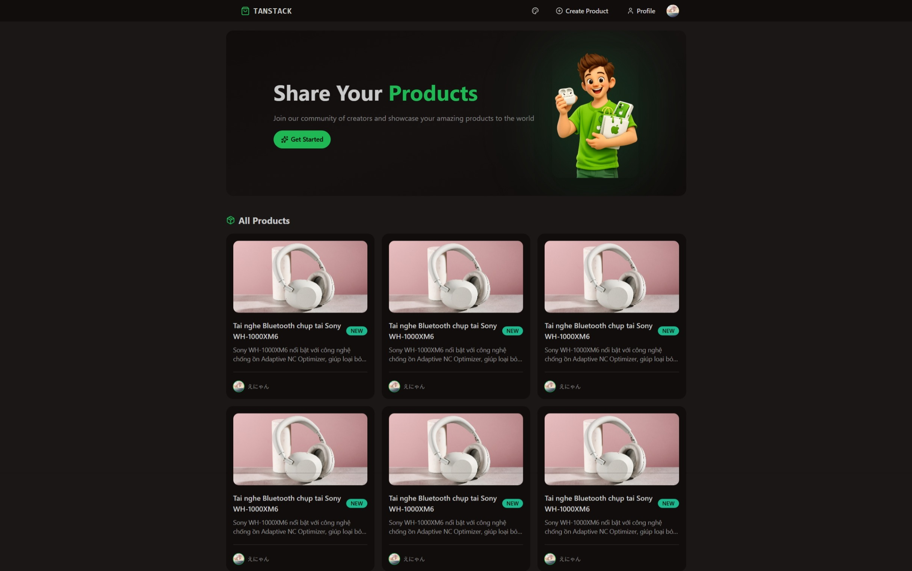

# React Vite + TanStack Query

A mini e-commerce project built for practice purposes

## Tech Stack

- React, Express, PostgreSQL, TanStack Query, Zustand, TailwindCSS, DaisyUI

## Screenshot

<table align="center" width="100%">
  <tr>
    <td>
      
    </td>
  </tr>
</table>

## Prerequisites

- [Node.js](https://nodejs.org/) (v20 or higher)

## Installation

1. Clone this repository or download the source code
2. Set up the `.env` file for the backend
3. Open terminal and navigate to the backend directory:

```bash
cd backend
npm install
npm run dev
```

4. Open another terminal and navigate to the frontend directory:

```bash
cd frontend
npm install
npm run dev
```

This will launch the application in your default web browser.
